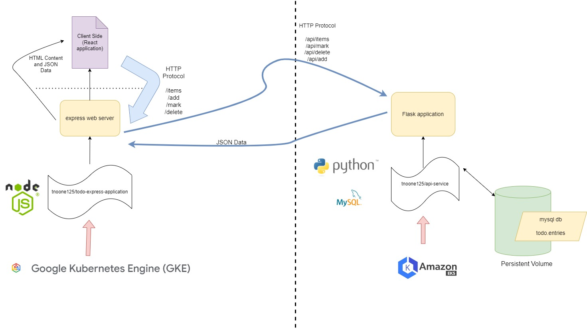

# cloudcomputing-final-project
I completed this as the final project for Fordham's CISC 5550 - Cloud Computing.

This repository has two parts - a Python Flask application and an Express server run on Node.js.

The Python Flask application persists "Todo" tasks to a MySQL database (found in a persistent volume)
I deployed this application to an AWS EKS Cluster. You can find the `docker-compose.yml` for local containers, and I used `kompose convert` to create `deployment.yaml` and `service.yaml` files.

The second part is an express web server which produces a React client-side application. As users interact with the application, the express web server will send HTTP requests to the Flask application on the AWS cluster.
I Dockerized the web application (`tnoone125/todo-express-application`) and deployed it to a simple GCloud Cluster. You can find relevant terminal prompts in `command_summary.sh.` See my full write-up `Final Project Writeup Noone.pdf`

Note for the Express server development, I referenced a Medium article for help on serving the React application from a web server: https://medium.com/simform-engineering/how-to-implement-ssr-server-side-rendering-in-react-18-e49bc43e9531

